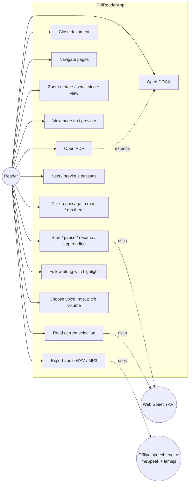
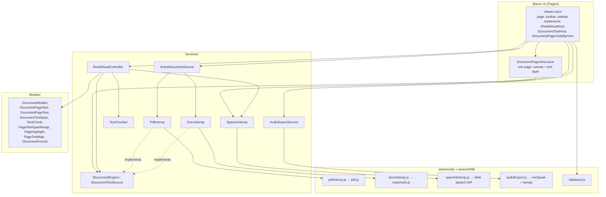
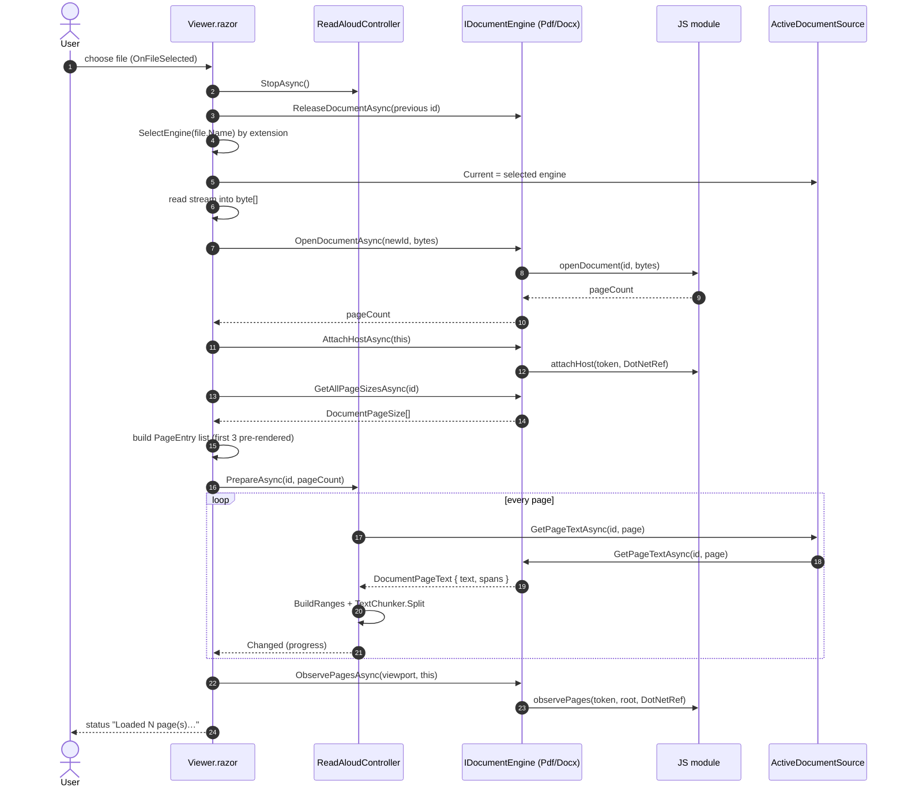
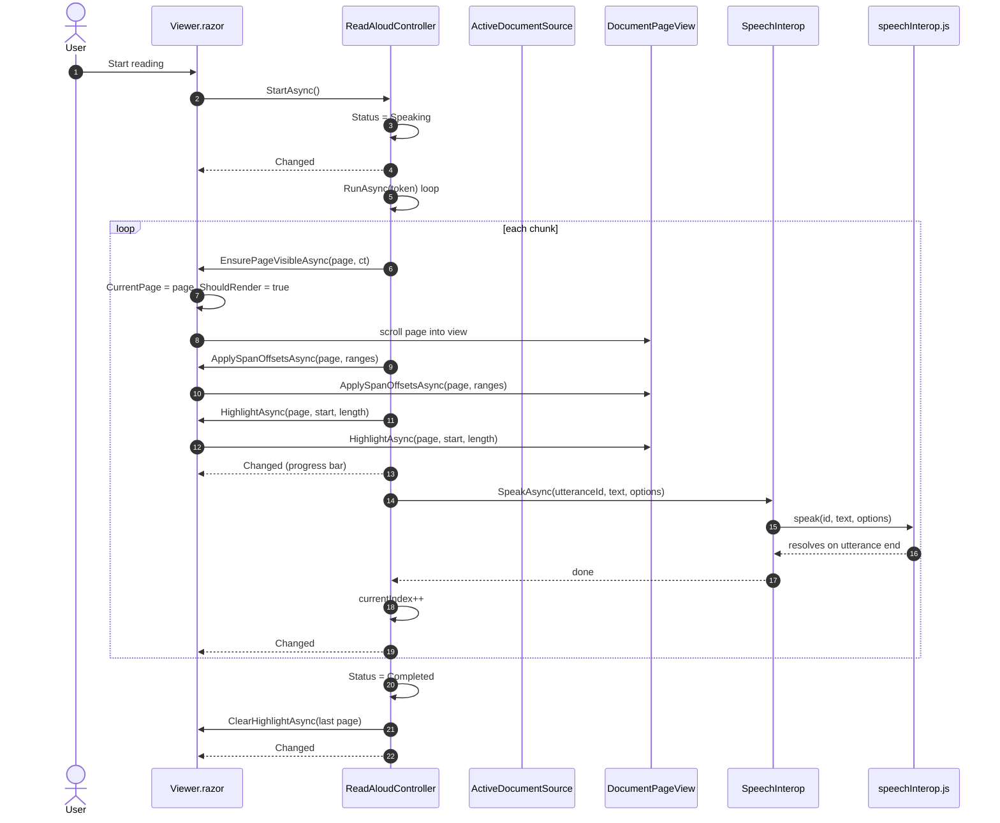
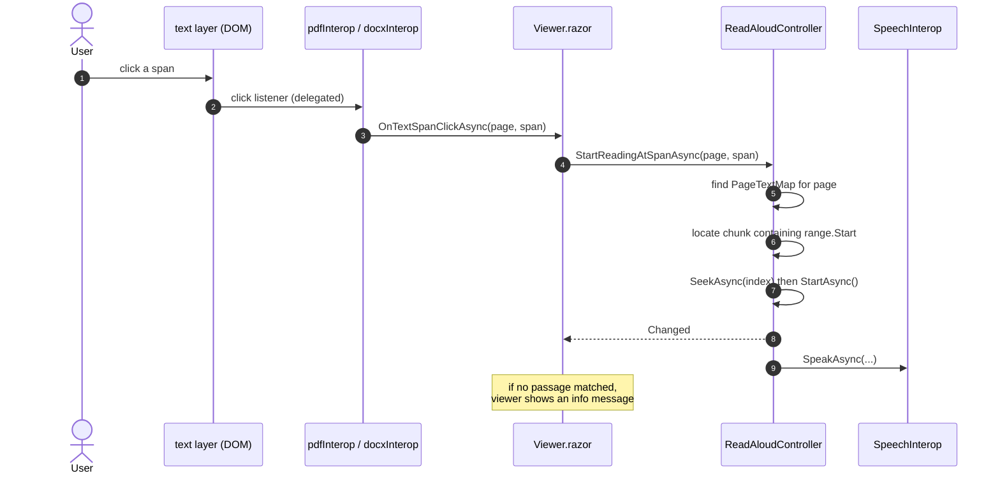
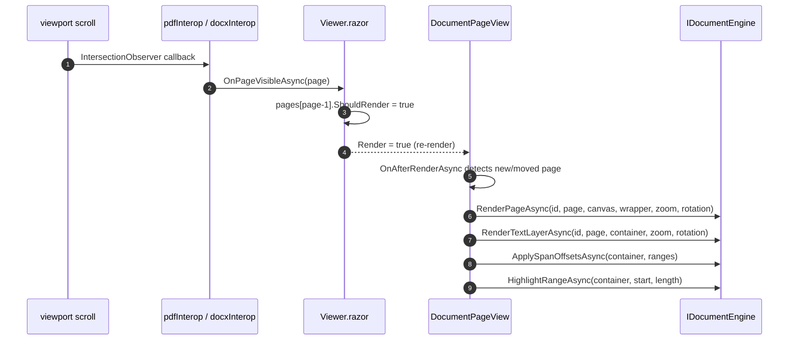
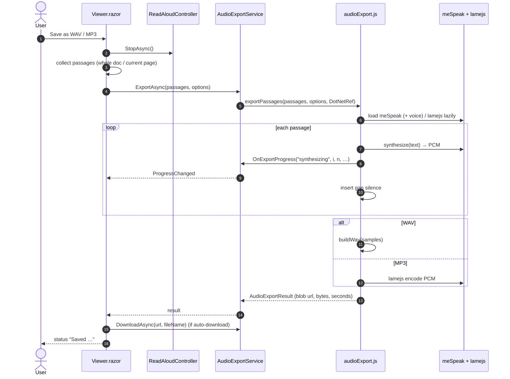
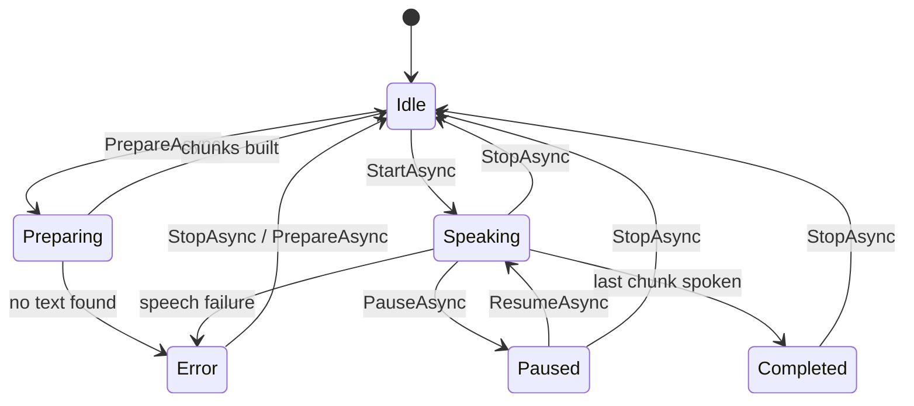
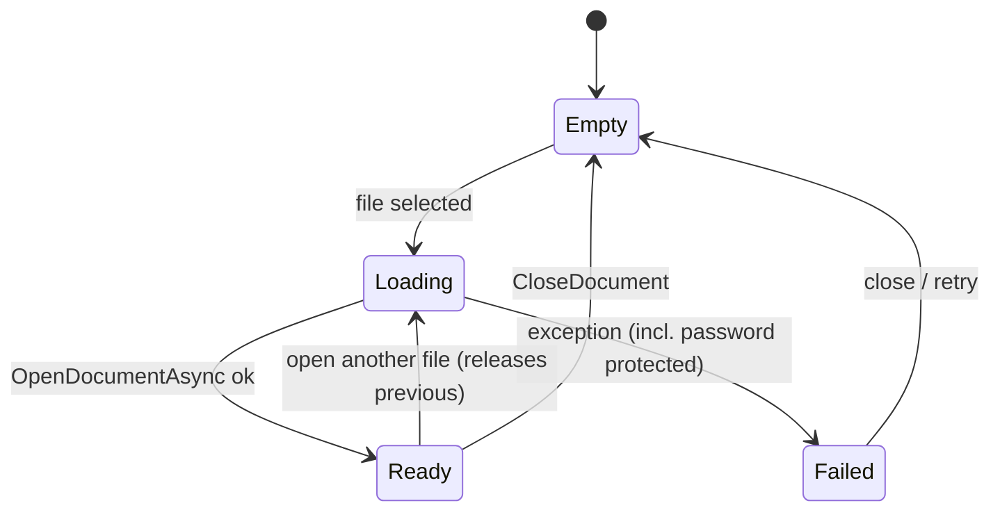

# PdfReaderApp — Technical Architecture

A .NET 10 Blazor WebAssembly application that opens PDF and Word (`.docx`)
documents, renders them page by page, reads them aloud with the browser's Web
Speech API, highlights the passage being spoken, and can render the whole
document to a downloadable WAV or MP3 file entirely offline.

Everything runs client side in the browser. No document ever leaves the machine.

---

## 1. Context and goals

| Goal | How it is met |
| --- | --- |
| Open more than one document type | A per-format `IDocumentEngine` behind a common page/text model. |
| Preserve read-aloud for every format | `ReadAloudController` depends on `IDocumentTextSource`, not on a concrete reader. |
| Keep one text-offset model | Engines emit numbered spans whose offsets index the page text; the same offsets drive click-to-read and highlighting. |
| Work without a server | PDF via pdf.js, DOCX via mammoth.js, speech via Web Speech API, export via meSpeak + lamejs. |
| Stay responsive on large files | Pages render lazily as an `IntersectionObserver` reports them near the viewport. |

### Runtime environment

- Blazor WebAssembly on .NET 10 (`net10.0`), `Microsoft.AspNetCore.Components.WebAssembly`.
- Browser APIs: Canvas 2D, Web Speech API, IntersectionObserver, Web Workers
  (inside pdf.js), Blob/object URLs.
- Vendored libraries under `wwwroot/lib`: pdf.js, mammoth.js, meSpeak, lamejs.

---

## 2. Use case diagram

Actors: the **Reader** (a person using the app), the **Web Speech API** (online
playback) and the **Offline speech engine** (meSpeak + lamejs, used for export).

Notes on the relationships:

- **Open PDF / Open DOCX** are the two entry use cases. The engine chosen is the
  only thing that differs between them; every downstream use case is shared.
- **Click a passage to read from there** and **Follow along with highlight** are
  the two "text layer is interactive" use cases; both rely on the shared offset
  model.
- **Export audio** deliberately uses a different engine from playback, because the
  Web Speech API can play but cannot return samples.

---

## 3. Component view

---

## 4. Class diagram

The central idea is a small interface split: **rendering** lives in
`IDocumentEngine`, while **text access** lives in the narrower
`IDocumentTextSource` that the read-aloud controller consumes. `ActiveDocumentSource`
is the seam that lets one long-lived controller follow whichever engine is open.

```mermaid
classDiagram
    direction TB

    class IDocumentTextSource {
        <<interface>>
        +bool IsInitialized
        +InitializeAsync(CancellationToken) Task
        +OpenDocumentAsync(id, bytes, CancellationToken) Task~int~
        +ReleaseDocumentAsync(id) Task
        +GetAllPageSizesAsync(id) Task~DocumentPageSize[]~
        +GetPageTextAsync(id, page) Task~DocumentPageText~
        +ApplySpanOffsetsAsync(container, ranges) Task
        +HighlightRangeAsync(container, start, length) Task~int[]~
        +ClearHighlightAsync(container) Task
    }

    class IDocumentEngine {
        <<interface>>
        +DocumentFormat Format
        +string DisplayName
        +RenderPageAsync(id, page, canvas, wrapper, scale, rotation) Task
        +RenderTextLayerAsync(id, page, container, scale, rotation) Task
        +AttachHostAsync(host) Task~string~
        +DetachHostAsync(token) Task
        +ObservePagesAsync(root, host) Task~string~
        +UnobservePagesAsync(token) Task
        +ScrollToPageAsync(root, page) Task
    }

    class IDocumentTextHost {
        <<interface>>
        +OnTextSpanClickAsync(page, span) Task
    }

    class IDocumentPageVisibilityHost {
        <<interface>>
        +OnPageVisibleAsync(page) Task
    }

    class IReadAloudHost {
        <<interface>>
        +EnsurePageVisibleAsync(page, ct) Task
        +HighlightAsync(page, start, length) Task
        +ClearHighlightAsync(page) Task
        +ApplySpanOffsetsAsync(page, ranges) Task
        +ScrollSpanIntoViewAsync(page, span) Task
    }

    class ActiveDocumentSource {
        +IDocumentTextSource Current
        +InitializeAsync() Task
        +OpenDocumentAsync() Task~int~
        +ReleaseDocumentAsync() Task
        +GetAllPageSizesAsync() Task
        +GetPageTextAsync() Task
        +ApplySpanOffsetsAsync() Task
        +HighlightRangeAsync() Task
        +ClearHighlightAsync() Task
    }

    class PdfInterop {
        +DocumentFormat Format = Pdf
        +string DisplayName = "PDF"
        +InitializeAsync() Task
        +RenderPageAsync() Task
        +RenderTextLayerAsync() Task
        +AttachHostAsync() Task~string~
        +ObservePagesAsync() Task~string~
        +ScrollToPageAsync() Task
    }

    class DocxInterop {
        +DocumentFormat Format = Docx
        +string DisplayName = "Word document"
        +InitializeAsync() Task
        +RenderPageAsync() Task
        +RenderTextLayerAsync() Task
        +AttachHostAsync() Task~string~
        +ObservePagesAsync() Task~string~
        +ScrollToPageAsync() Task
    }

    class ReadAloudController {
        -IDocumentTextSource source
        -SpeechInterop speech
        -List~TextChunk~ chunks
        -Dictionary~int,PageTextMap~ pageMaps
        -int currentIndex
        +ReadAloudStatus Status
        +string ErrorMessage
        +SpeechOptions Options
        +bool IsReady
        +bool IsActive
        +double Progress
        +TextChunk CurrentChunk
        +event Func~Task~ Changed
        +SetHost(IReadAloudHost)
        +PrepareAsync(documentId, pageCount, ct) Task
        +StartAsync() Task
        +StartReadingAtSpanAsync(page, span) Task
        +SeekAsync(index) Task
        +NextAsync() Task
        +PreviousAsync() Task
        +PauseAsync() Task
        +ResumeAsync() Task
        +StopAsync() Task
        +RestartAsync() Task
        +JumpToPageAsync(page) Task
        +ReadTextAsync(text) Task
        +GetSpanOffsetsForPage(page) IReadOnlyList~PageTextSpanRange~
    }

    class SpeechInterop {
        +bool IsSupported
        +event Func~string,Task~ StateChanged
        +event Func~int,int,int,Task~ BoundaryReached
        +InitializeAsync() Task
        +GetVoicesAsync(wait) Task~SpeechVoice[]~
        +SpeakAsync(utteranceId, text, options) Task~string~
        +PauseAsync() Task
        +ResumeAsync() Task
        +CancelAsync() Task
        +OnSpeechStateChanged(state) Task
        +OnSpeechBoundary(id, idx, len) Task
    }

    class AudioExportService {
        +bool IsSupported
        +event Func~AudioExportProgress,Task~ ProgressChanged
        +InitializeAsync() Task
        +GetVoicesAsync() Task~string[]~
        +ExportAsync(passages, options, ct) Task~AudioExportResult~
        +CancelAsync() Task
        +DownloadAsync(url, fileName) Task
        +ReleaseAsync(url) Task
        +OnExportProgress(...) Task
    }

    class TextChunker {
        <<static>>
        +Split(text, maxLength) IEnumerable~string~
    }

    class Viewer {
        -IDocumentEngine engine
        -IDocumentEngine hostEngine
        -IDocumentEngine visibilityEngine
        -List~PageEntry~ pages
        -int CurrentPage
        -double Zoom
        -double RotationDegrees
        +SelectEngine(fileName) IDocumentEngine
        +OnFileSelected(args) Task
        +OnTextSpanClickAsync(page, span) Task
        +OnPageVisibleAsync(page) Task
        +EnsurePageVisibleAsync(page, ct) Task
    }

    class DocumentPageView {
        +IDocumentEngine Engine
        +string DocumentId
        +int PageNumber
        +DocumentPageSize Size
        +double Zoom
        +double Rotation
        +bool Render
        +IReadOnlyList~PageTextSpanRange~ SpanOffsets
        +PageHighlight Highlight
    }

    class DocumentFormat {
        <<enumeration>>
        Pdf
        Docx
    }

    class DocumentPageSize {
        +double Width
        +double Height
    }

    class DocumentTextSpan {
        +int Num
        +string Text
        +int Start
        +string Kind
    }

    class DocumentPageText {
        +string Text
        +List~DocumentTextSpan~ Spans
    }

    class TextChunk {
        +int Index
        +int PageNumber
        +int Start
        +int Length
        +string Text
        +int End
    }

    class PageTextSpanRange {
        <<record>>
        +int Num
        +int Start
        +int Length
        +int End
    }

    class PageHighlight {
        <<record>>
        +int PageNumber
        +int Start
        +int Length
    }

    class PageTextMap {
        +int PageNumber
        +string Text
        +IReadOnlyList~PageTextSpanRange~ SpanRanges
    }

    IDocumentEngine --|> IDocumentTextSource : extends
    IDocumentEngine ..|> IAsyncDisposable
    PdfInterop ..|> IDocumentEngine : implements
    DocxInterop ..|> IDocumentEngine : implements
    ActiveDocumentSource ..|> IDocumentTextSource : implements
    ActiveDocumentSource o-- IDocumentTextSource : forwards to Current

    ReadAloudController --> IDocumentTextSource : reads text
    ReadAloudController --> SpeechInterop : plays
    ReadAloudController --> TextChunker : splits
    ReadAloudController o-- IReadAloudHost : drives
    ReadAloudController *-- TextChunk
    ReadAloudController *-- PageTextMap

    Viewer ..|> IReadAloudHost
    Viewer ..|> IDocumentTextHost
    Viewer ..|> IDocumentPageVisibilityHost
    Viewer --> IDocumentEngine : selected engine
    Viewer *-- DocumentPageView
    Viewer o-- ReadAloudController
    Viewer o-- AudioExportService
    Viewer o-- SpeechInterop
    Viewer --> ActiveDocumentSource : points at engine

    DocumentPageView --> IDocumentEngine
    DocumentPageView o-- PageTextSpanRange
    DocumentPageView o-- PageHighlight

    DocumentPageText *-- DocumentTextSpan
    PageTextMap *-- PageTextSpanRange
    PageTextMap o-- DocumentTextSpan
    PdfInterop ..> DocumentFormat
    DocxInterop ..> DocumentFormat
```

### Responsibilities

| Type | Responsibility |
| --- | --- |
| `IDocumentEngine` | Open/render/release one format and expose its text layer and pages. |
| `IDocumentTextSource` | The read-aloud subset: open, page sizes, page text, span offsets, highlight. |
| `ActiveDocumentSource` | Indirection so `ReadAloudController` follows the engine of the open file. |
| `PdfInterop` / `DocxInterop` | Format engines; each is a thin C# façade over one JS module. |
| `ReadAloudController` | Chunking, playback state machine, current passage and highlight range. |
| `SpeechInterop` | Web Speech API bridge; raises state and boundary events back to .NET. |
| `AudioExportService` | Offline WAV/MP3 rendering and download handling. |
| `TextChunker` | Splits page text into utterance-sized passages at sentence boundaries. |
| `Viewer` | Orchestrates open, layout, navigation, read-aloud wiring and export UI. |
| `DocumentPageView` | Renders a single page and applies span offsets / highlight. |

---

## 5. Document model and the offset invariant

Every engine produces, per page, a `DocumentPageText`:

- `Text` — the plain page text, with spans joined by separators (`\n` for DOCX
  blocks, pdf.js item spacing for PDF).
- `Spans` — ordered `DocumentTextSpan { Num, Text, Start, Kind }`, where `Start`
  is the offset of that span inside `Text`.

`ReadAloudController.BuildRanges` converts spans into `PageTextSpanRange { Num,
Start, Length }`. Those ranges are pushed to the DOM via `applySpanOffsets`, which
writes `data-begin` / `data-end` on each `span[data-num]`. Highlighting then
intersects the spoken character range with those attributes.

**Invariant:** the docs, spans, chunk offsets and highlight ranges all index the
same page-text string. Changing how any engine builds its page text requires
updating its span offsets in the same change.

---

## 6. Sequence diagrams

### 6.1 Open a document

### 6.2 Read aloud, with follow-along highlight

Note: `HighlightAsync` / `ApplySpanOffsetsAsync` on the viewer are declarative —
the viewer updates its `Highlight` / `SpanOffsets` parameters and
`DocumentPageView.OnAfterRenderAsync` performs the actual interop call, so the
highlight always matches the rendered text layer.

### 6.3 Click a passage to read from there

### 6.4 Lazy page rendering

Rendering is also re-run when zoom, rotation or document id changes, because
`DocumentPageView` tracks `renderedZoom`, `renderedRotation` and
`documentIdRendered`. DOCX pages are not repaginated on zoom: they are laid out
once at 100% and scaled with a CSS `transform`.

### 6.5 Export audio to WAV / MP3

`wwwroot/js/audioExport.js` converts UI multipliers into engine units before
calling meSpeak: `speed` is words per minute, `pitch` is 0–99, `amplitude` is
0–200. Passing `1.0` for all three produces near-inaudible audio that still has a
non-zero byte length.

---

## 7. State models

### Read-aloud status

### Document lifecycle

---

## 8. Interop contract (C# ⇄ JS)

Each JS module is an ES module imported on demand via `IJSRuntime` and cached as
an `IJSObjectReference`. Callback functions are raised into .NET through a
`DotNetObjectReference<T>` whose target method carries `[JSInvokable]`.

| C# | JS module | JS entry points |
| --- | --- | --- |
| `PdfInterop` | `js/pdfInterop.js` | `openDocument`, `releaseDocument`, `renderPage`, `renderTextLayer`, `getPageText`, `getAllPageSizes`, `attachHost`, `detachHost`, `highlightRange`, `clearHighlight`, `applySpanOffsets`, `observePages`, `unobservePages`, `scrollToPage`, `scrollToSpan`, `ensureTextLayerStyles` |
| `DocxInterop` | `js/docxInterop.js` | `openDocument`, `releaseDocument`, `renderPage`, `renderTextLayer`, `getPageText`, `getAllPageSizes`, `attachHost`, `detachHost`, `highlightRange`, `clearHighlight`, `applySpanOffsets`, `observePages`, `unobservePages`, `scrollToPage`, `scrollToSpan` |
| `SpeechInterop` | `js/speechInterop.js` | `supported`, `init`, `waitForVoices`, `getVoices`, `speak`, `pause`, `resume`, `cancel`, `getState`, `dispose` |
| `AudioExportService` | `js/audioExport.js` | `supported`, `listVoices`, `exportPassages`, `cancelExport`, `download`, `release` |
| `Viewer` (selection) | `js/clipboard.js` | `getPdfSelection` |

JS → .NET callbacks:

| JS call | .NET target | Interface |
| --- | --- | --- |
| `OnTextSpanClickAsync` | `Viewer` | `IDocumentTextHost` |
| `OnPageVisibleAsync` | `Viewer` | `IDocumentPageVisibilityHost` |
| `OnSpeechStateChanged`, `OnSpeechBoundary` | `SpeechInterop` | — |
| `OnExportProgress` | `AudioExportService` | — |

Host attachments are keyed by a random token so several engines (and several page
layers) can coexist and be detached independently.

---

## 9. Format engines

### PDF (`PdfInterop` + `pdfInterop.js`)

- pdf.js is vendored (`wwwroot/lib/pdfjs`), including cmaps, standard fonts, wasm
  and ICC profiles; the worker is loaded from the same folder.
- Pages are rendered to a canvas at `devicePixelRatio`, then a pdf.js text layer
  is positioned over it.
- The text layer uses the absolutely-positioned `.textLayer` styles; span offsets
  are applied per page and reused for click-to-read and highlighting.
- Documents are reference counted by id; pages are cached by `documentId:page`.
- `releaseDocument` destroys the document through `doc.loadingTask.destroy()`
  (pdf.js 6.x moved `destroy` off `PDFDocumentProxy`), with a fallback to
  `doc.destroy()` for older builds.

### DOCX (`DocxInterop` + `docxInterop.js`)

- `mammoth.browser.min.js` converts the WordprocessingML to HTML.
- The HTML is sanitised: `script`/`iframe`/`object`/`embed`/`link`/`meta`/`style`/
  `base` are removed, `on*` attributes and `javascript:` URLs are stripped.
- The body is split into top-level blocks; a list with several items is split per
  item so it can span pages. Each unit is measured with an off-screen element that
  carries the same `document-content` typography as the rendered page.
- Units are packed into letter-sized pages (816×1056 CSS px, 96 px margins) until
  the measured height would exceed the content box.
- Each page is rendered as flow HTML in a `.document-layer`, scaled and rotated
  with a CSS `transform` (so pagination happens once at 100%).
- Text nodes are wrapped in `span[data-num]` elements, matching the PDF offset
  model, so highlighting and click-to-read behave identically.

---

## 10. Cross-cutting concerns

| Concern | Approach |
| --- | --- |
| Failures | Engine interop is wrapped; `JSException`/`JSDisconnectedException` are caught around calls that can race with navigation or shutdown. Password-protected PDFs are detected and reported. |
| Security | No upload; files stay in memory. DOCX HTML is sanitised before insertion. No inline handlers from documents run. |
| Performance | Lazy page rendering, pdf.js worker off the main thread, per-page caches, and an early-exit `PrepareAsync` when the same document is already chunked. |
| Accessibility | Native controls, labelled inputs, and a text preview of the page as it will be read. |
| Extensibility | A new format means one `IDocumentEngine` implementation plus a `SelectEngine` branch; read-aloud, highlight, preview and export need no changes. |

---

## 11. Adding another format (worked outline)

1. Add the value to `DocumentFormat` in `Models/DocumentModels.cs`.
2. Add a JS module under `wwwroot/js` exposing the engine entry points listed in
   §8, emitting `DocumentPageText` with `Start` offsets for every span.
3. Add a C# façade implementing `IDocumentEngine`, modelled on `DocxInterop`.
4. Register it in `Program.cs` (`AddScoped`) and add a branch in
   `Viewer.SelectEngine` keyed on the file extension.
5. Add the extension to the `InputFile` `accept` attributes.
6. Nothing in `ReadAloudController`, `DocumentPageView` or
   `AudioExportService` changes, provided the offset invariant in §5 holds.
